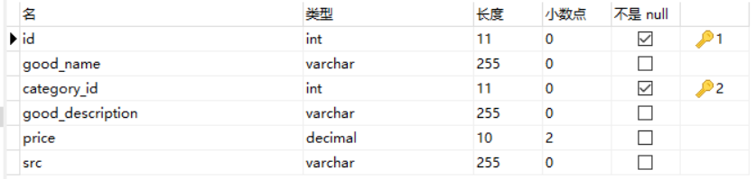
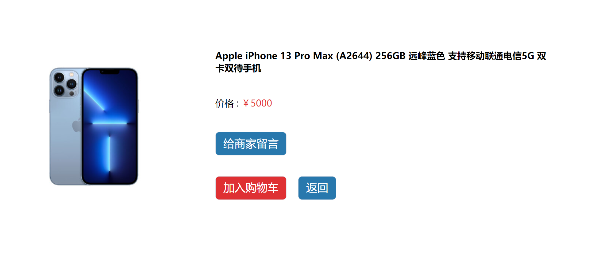

改项目为一个简易的二手平台交易网站, 所用到的技术如下

前端: vue3, vue-router, vuex, element-plus, vite

后端: lerna, koa, koa-router, mysql2, @koa/cors

### 后端代码

后代代码结构如下


后端代码通过 `lerna` 创建, 通过 `lerna create` 命令在 `packages` 中创建 2 个子包

- core: 框架核心工程
- run: 负责项目具体业务

在最外层 `package.json` 中

```
"dev": "cross-env NODE_ENV=development nodemon -e ts,ejs --exec ts-node -T ./packages/run/src/index.ts"
```

运行 `run/src/index.ts` 下的代码

```ts
import Run from 'core/src'
Run({ appPath: __dirname })
```

在 `core/src/index.ts` 下 有类似如下代码, 用于启动项目

```ts
const hooks = ['mysql', 'bodyparser', 'cors', 'router', 'lift'];
export default async function Run(params: Params) {
  const allHooks: Hook[] = await getHooks(hooks);
  for (const hook of allHooks) {
    await hook.default(app)
}
  
export const getHooks = async (hooks: string[]) => {
  const result: any[] = []
  for (let i = 0;i < hooks.length;i++) {
    const hook = await import(path.join(__dirname, "../hooks", hooks[i]));
    result.push(hook)
  }
  return result
}
```

hooks 表明在 `core/src/hooks` 下的所有文件名, 该目录主要存放框架中各类独立模块的实现

#### 连接数据库

在 `core/src/hooks/mysql.ts` 下, 使用 msql2 , 并将创建的连接存入 `ctx.mysql` 中, 方便之后通过 ctx 使用

```ts
import mysql from 'mysql2';
export default async (app) => {
  const config = app.config?.mysql || {};
  if (config?.host && config?.user && config?.password && config?.database) {
    const connection = mysql.createConnection(config);
    connection.connect();
    app.use((ctx, next) => {
      ctx.mysql = connection;
      return next()
    })
  }
}
```

#### 路由读取

在 `core/src/hooks/routers.ts` 下,通过 glob, 递归读取所匹配的子目录, 通过 `await import` 导入 `run/src/routers/` 下的 所有文件, 然后 push 进 `routers` 中, 再将 `routers` 通过 `koa-compose` 将多个函数合并成一个函数

```ts
import glob from 'glob';
import path from 'path';
import compose from 'koa-compose';

export default async (app) => {
  const routerFiles = glob.sync(path.resolve(app.appPath, './routers', `**/*${app.extName}`));
  const registerRouter = async () => {
    let routers: any[] = [];
    for (let file of routerFiles) {
      const router = await import(file);
      routers.push(router.default.routes());
    }
    return compose(routers)
  }
  app.use(await registerRouter())
}
```

#### 配置文件读取

在 `core/src/index.ts` 在 

最初, 启动项目命令 `cross-env NODE_ENV=development nodemon -e ts,ejs --exec ts-node -T ./packages/run/src/index.ts"`

传入 NODE_ENV 变量, 通过 `process.env.NODE_ENV` 获取, 将其与 `run/src/config` 进行拼接, 生成配置文件路径, 存入 app 中, 之后可通过 `app.config` 使用配置文件中的内容

```js
const env = process.env.NODE_ENV
const extName = app.extName = env === 'development' ? '.ts' : '.js';

const baseConfig = await import(path.join(appPath, `config/config.base${extName}`))
const curConfig = await import(path.join(appPath, `config/config.${env}${extName}`));
app.config = deepMerge(baseConfig.default(app), curConfig.default(app));
```

### 数据库

mysql 使用两张表

分类表 category


商品表 goods



查询语句

```sql
select g.id,g.good_name,c.category_name,g.good_description,g.price,g.src from goods g,category c where g.category_id = c.id
```

### 前端代码

#### 主界面


#### 模糊查询


#### 商品详情界面



#### 付款界面


#### 订单界面


